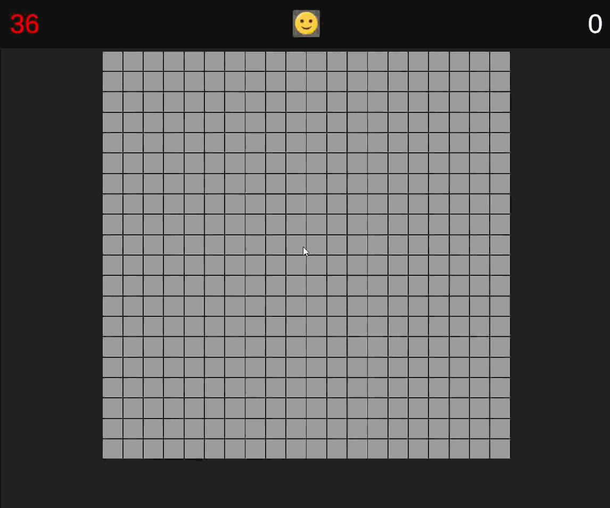

# Minesweeper

A Minesweeper clone built in Unity as a test assignment
(reference: [minesweeper.online](https://minesweeper.online)).

The focus of this project is **clean, layered, testable architecture** — not visuals.

## ▶ Play

- **WebGL build:** [DEMO](https://laskka.github.io/Minesweeper/)
- Or run it locally (see [Run locally](#run-locally)).

## Demo

<p align="center">
  <br>
  <em>Menu → game → win / lose → restart</em>
</p>

| Flood-fill chain reveal | Pause — timer freezes |
|:---:|:---:|
|  |  |

## Controls

| Input           | Action |
|-----------------|---|
| **Left click**  | Reveal a cell |
| **Right click** | Toggle a flag |
| **R**           | Restart at any time |

The **first click is always safe** — mines are placed after it, never under it.

## Configuration

Field size and mine count are driven by a **`GameSettings` ScriptableObject** — no UI
needed, as allowed by the assignment. Select the `GameSettings` asset (referenced by
`AppLifetimeScope` in the scene) and edit `Width` / `Height` / `MineCount`.

The asset is just an authoring surface: it produces an immutable, **Unity-free**
`GameConfig` domain value, so the game rules never depend on `UnityEngine`.

## Run locally

1. Unity **6000.3.9f1** (Unity 6.3).
2. Open the project, then open `Assets/Scenes/SampleScene.unity`.
3. Press **Play**.

## Architecture

Three layers, dependencies pointing inward:

```
Domain  ◄──  Application  ◄──  Presentation
```

- **Domain** — pure data and rules, zero Unity references:
  `Cell`, `CellState`, `BoardState`, `GameConfig`.
- **Application** — game logic as plain C# (testable, no `MonoBehaviour`):
  `BoardSystem` (board, mine placement, flood-fill), `GameResultDetector`
  (win/lose), `GameSession` (round rules), `GameFlow` (screen flow).
- **Presentation** — Unity-facing views and input. Subscribes to Application
  state via [R3](https://github.com/Cysharp/R3), never the other way around.

Wiring is done with **[VContainer](https://github.com/hadashiA/VContainer)**;
`AppLifetimeScope` is the single composition root.

### Two state machines

State is split into two layers instead of one over-stuffed enum:

| Machine | Owner | States | Responsibility |
|---|---|---|---|
| **Round** | `GameSession.Phase` | `AwaitingFirstMove` → `Playing` → `GameOver` | game rules: when input is allowed |
| **Screen** | `GameFlow.State` | `MainMenu` / `InGame` / `Paused` / `GameOver` | what's on screen, which buttons are active |

`ScreenRouter` subscribes to `GameFlow.State` and toggles each panel (and the board
itself) via a shared `ViewRoot` base. Buttons call `GameFlow` commands; input is gated
so the board only reacts while `InGame`.

### Notable pieces

- `SessionTimer` — display-only timer; ticks only while `InGame && Playing`, so pause
  and game-over freeze it for free (no `Time.timeScale` hacks). Lives in Presentation,
  keeping the logic layer Unity-free.
- `Cheats` — isolated, self-contained hotkey module, easy to strip from a build.
- `BoardView` / `BoardInputHandler` / `CameraFitter` — board rendering, mouse input
  (math-based picking), and orthographic camera fit.

## Tests

EditMode unit tests under `Assets/App/Tests/EditMode`:

- **`BoardSystemTests`** — first-click safety, exact mine count, adjacency counts,
  flood-fill invariants, reveal/flag rules, lose-reveals-all.
- **`GameConfigTests`** — validation and mine-count clamping.

Because mine placement is randomized, the tests assert **invariants** (true for any
board) rather than fixed layouts, so they stay deterministic and non-flaky.

Run via **Window → General → Test Runner → EditMode → Run All**.

## Tech stack

Unity 6.3 (URP 2D) · C# · VContainer (DI) · R3 (reactive) · TextMeshPro ·
Unity Test Framework (NUnit).

## Project structure

```
Assets/App/
├── Scripts/
│   ├── Domain/         # Cell, BoardState, GameConfig, CellState
│   ├── Application/    # BoardSystem, GameResultDetector, GameSession, GameFlow
│   ├── Presentation/   # BoardView, input, SessionTimer, Cheats, UI/ (views + router)
│   └── Main/           # AppLifetimeScope (composition root), GameSettings (SO)
└── Tests/EditMode/     # BoardSystemTests, GameConfigTests
```
